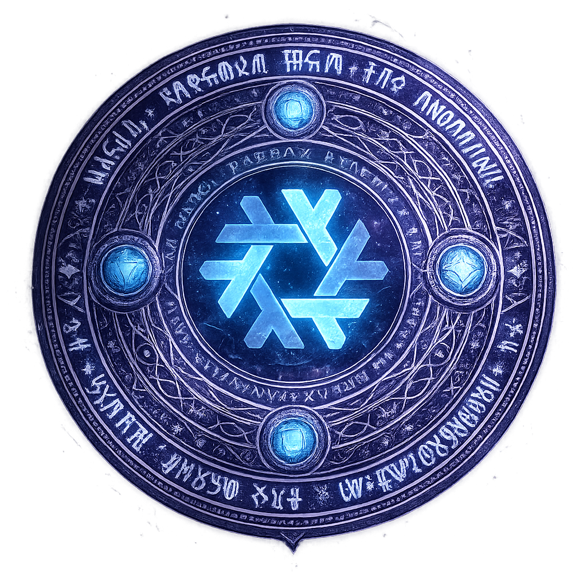

<h1 id="header" align="center">
    
     
    grimoire
</h1>

This is my personal grimoire full of declarative nix magic. It includes all configurations for my NixOS machines,
and my dotfiles managed through home-manager (for now). Deployment, management and secrets are handled through
[clan](https://clan.lol/).

# Infrastructure

My current machines are:

| Configuration                          | Type    | Location | Description        |
| -------------------------------------- | ------- | -------- | ------------------ |
| [Judradjim](./machines/judradjim/)     | Desktop | local    | My main desktop PC |
| [Nephtear](./machines/nephtear/)       | Handeld | local    | Steam Deck         |
| [Zoltraak](./machines/zoltraak/)       | Server  | local    |                    |
| [Catastravia](./machines/catastravia/) | Server  | Hetzner  |                    |

## Services

TODO

## Credits

This configuration is inspired by and borrows from:

- [NotAShelf/nyx](https://github.com/NotAShelf/nyx)
- [Misterio77/nix-config](https://github.com/Misterio77/nix-config/tree/main)
- [niksingh710/ndots](https://github.com/niksingh710/ndots)
- [JManch/nixos](https://github.com/JManch/nixos)
- [notthebee/nix-config](https://git.notthebe.ee/notthebee/nix-config)
- [darkone-linux/darkone-nixos-framework](https://github.com/darkone-linux/darkone-nixos-framework)
- [pinpox/nixos](https://github.com/pinpox/nixos)
- [badele/nix-homelab](https://github.com/badele/nix-homelab)
